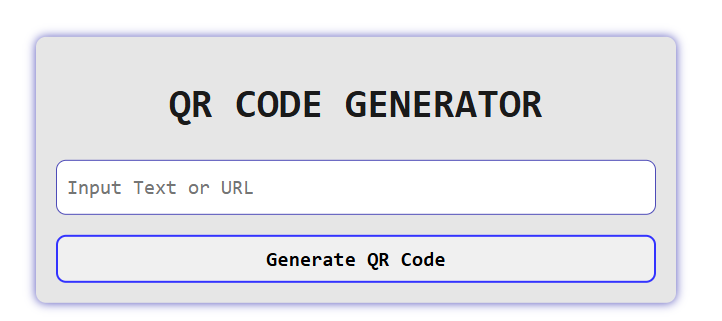
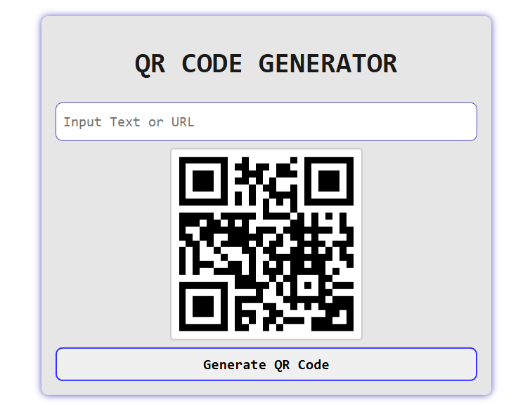

# QR Code Generator 🏷️

A simple and interactive **QR Code Generator** built with **HTML, CSS, jQuery**, and the [GoQR API](https://goqr.me/api/). Enter a URL or text, and instantly generate a QR code that can be scanned using any QR code scanner.

---

## 🚀 Live Demo
👉 **[View Live Project](#)** 

---

## 📌 Features

✅ User-friendly interface  
✅ Generates a QR code for any input text or URL  
✅ Smooth animation when displaying the QR code  
✅ Handles empty input fields with an error animation  
✅ Fully responsive design  

---

## 🛠️ Technologies Used

- **HTML5**  
- **CSS3** (with animations & transitions)  
- **jQuery** (for dynamic functionality)  
- **GoQR API** (for generating QR codes)  

---

## 📂 Project Structure

📁 QR-Code-Generator 
    │── 📄 index.html # Main HTML structure 
    │── 📄 style.css # Styles and animations 
    │── 📄 index.js # jQuery logic for QR code generation │── 📄 README.md # Documentation

📖 How to Use
1️⃣ Enter a text or URL into the input field.
2️⃣ Click the "Generate QR Code" button.
3️⃣ Your QR code will be generated and displayed below.
4️⃣ Scan the QR code using any mobile device! 📱

## 📸 Screenshots

### 🔹 Before Generating QR Code:

### 🔹 After Generating QR Code:

❗ Known Issues & Fixes
1. QR Code not displaying? 
     * Ensure you have an active internet connection (since the QR codes are generated via an API).
2. Animation not working?
     * Try refreshing the page or clearing the browser cache.

🤝 Contributing
Want to improve this project? Feel free to fork, create a pull request, or open an issue!

1. Fork the repo
2. Create a new branch (git checkout -b feature-branch)
3. Commit changes (git commit -m "Added new feature")
4. Push to the branch (git push origin feature-branch)
5. Open a pull request 🚀

📜 License
This project is open-source and available under the MIT License.

📬 Contact
For any inquiries or collaboration, feel free to connect:

📧 Email: ososamuel246@gmail.com
🐦 Twitter: @_samuel_oso
📌 GitHub: Sammytee98

💡 Made with ❤️ by Big Sam